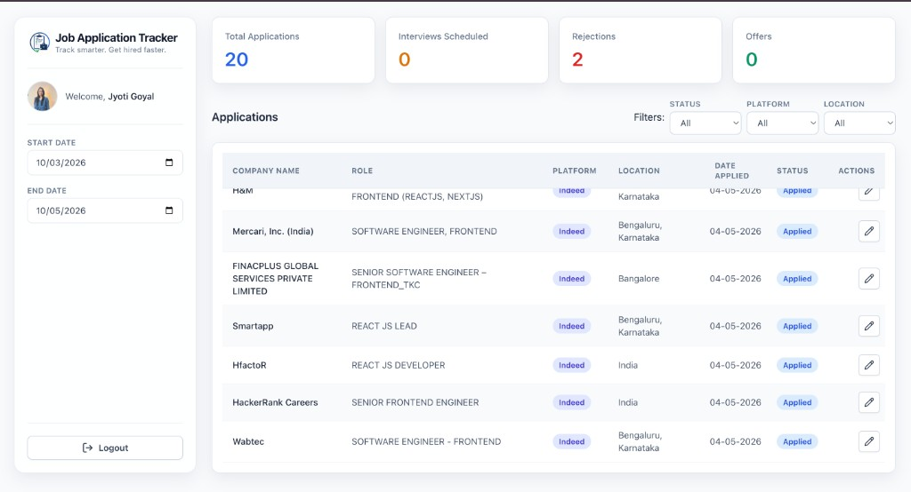

<div align="center">

# Job Tracker



**Gmail → PostgreSQL → one dashboard: KPIs, filters, and a virtualized applications table.**

_Track smarter. Get hired faster._

[](https://react.dev/)
[](https://www.typescriptlang.org/)
[](https://vitejs.dev/)
[](https://expressjs.com/)
[](https://www.postgresql.org/)

</div>

---

## 2. Inspiration

When you apply for jobs on several portals, everything piles into one Gmail inbox next to newsletters, social notifications, and other mail and alerts, so applications are easy to miss. Job Tracker shows them in one optimized dashboard — easy to track!

## 3. Overview

Sign in with Google OAuth; the backend uses the Gmail API in **read-only** mode. Sync does **not** scan your inbox: it only lists and fetches messages that match a **narrow job-application search query** (known job senders, date window, excluded subjects), so unrelated private mail is never requested by this code path. It parses each matching email for company, role, location, platform, and status, then stores rows in PostgreSQL. The dashboard shows those applications in a virtualized table with filters and summary counts. Built with TypeScript end to end: React on the front, Node.js + Express on the back, with login backed by a server session (the browser sends cookies on API calls so the server knows who you are).

## 4. Key Engineering Highlights / Optimizations

- **Virtualized table**: `@tanstack/react-virtual`, only visible rows are rendered, so long lists stay light in the DOM.
- **Paged infinite scroll**: API uses `LIMIT` / `OFFSET`; `IntersectionObserver` at the table bottom requests the next page.
- **Idempotent mail sync**: bulk `INSERT … ON CONFLICT (user_id, source_email_id) DO NOTHING` (`pg-format`) so retries / overlapping windows do not duplicate Gmail message IDs.
- **Rule-based parsing**: platform from `From`; Greenhouse / Workday fields via regex catalogs; plain vs HTML body chosen with heuristics + `html-to-text` when HTML wins.
- **Parallel Gmail fetches**: once Gmail returns matching message IDs, the server loads full messages in parallel so a sync finishes sooner than loading them one after another.

## 5. Tech Stack

| Layer        | Choices                                                         |
| ------------ | --------------------------------------------------------------- |
| Client       | React 19, TypeScript, Vite 8, Tailwind, React Router 7          |
| Data grid UX | TanStack Virtual, native `IntersectionObserver`                 |
| API          | Express 5, `pg`, `googleapis`, `html-to-text`, `pg-format`      |
| DB           | PostgreSQL (`users`, `oauth_tokens`, `applications`, `session`) |

## 6. Architecture Overview

```text
Browser (Vite + React)
  ├─ GET /auth/health          → is the user logged in? cache profile in localStorage
  ├─ GET /auth/google + callback → Google OAuth; tokens saved; session cookie set
  ├─ GET /mail/sync           → sync Gmail, fetch bodies, parse, write applications
  └─ GET /applications        → fetch applications for given date range + page + limit

server/src
  routes/*         → URL → handler
  controllers/*    → Gmail + SQL
  utils/mailParser → Gmail header/body parsing
  middlewares/session → CORS + session cookie + Postgres session store
```

Changing the **date range** runs a **mail sync** for that window, then the client reloads applications. Filters (status, platform, location) run in the browser over whatever pages are already loaded—they do not issue a separate filtered query to the server.

## 7. Challenges & Tradeoffs

- **Parsing**: vendors change email HTML often; new senders need new rules. That is quick to iterate for a personal app but does not cover every email format.
- **Filters only see loaded data**: dropdown filters apply to rows already fetched. That is simple and fast to build; it is misleading if someone expects “filter the entire account” without loading all pages.
- **Page numbers in SQL**: `OFFSET` is easy to implement; on very large tables, deep pages get slower. Cursor-based pagination would be the next step.
- **Gmail limits**: wide date ranges mean many API calls at once; there is no queue or automatic backoff yet.
- **Cookie login across two origins**: the React app and API run on different ports in dev; CORS must allow credentials and `CLIENT_URL` must match. Production should use HTTPS and the same cookie settings already toggled by `NODE_ENV`.

## 8. Get Started

**Prerequisites:** Node 20+, PostgreSQL, a Google Cloud OAuth client, Gmail API enabled.

**Environment files:** copy `server/.env.example` → `server/.env` and `.env.example` → `.env`, then fill in real values.

**Schema notes:** the `session` table is created by `connect-pg-simple` on first run when configured. The mail sync’s `ON CONFLICT` target expects Postgres to enforce uniqueness on `(user_id, source_email_id)` on `applications` (define that constraint however you manage the database).

**Run locally** (two terminals, both from the repo root)

**Frontend**

```bash
npm install
npm run dev
```

→ `http://localhost:5173`

**Server**

```bash
cd server
npm install
npm run dev
```

→ `http://localhost:3001`
